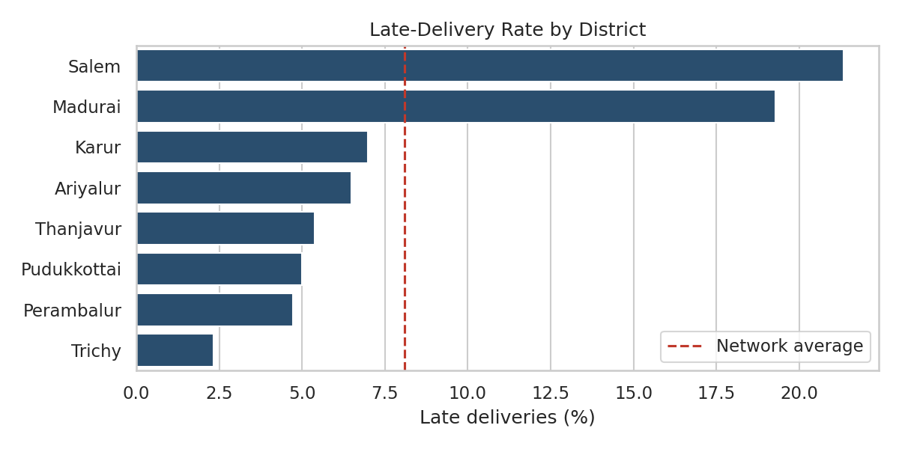

# Logistics Data Analysis: 4-Week Internship Project

Python data-science project on a logistics scenario ("SouthRoute Retail"): a regional e-commerce distributor with one warehouse, 12 delivery vans and eight destination districts. Each week builds on the previous one, from planning to predictive modeling and optimization.

**Author:** Dharanidharan P  |  **Internship:** Yuva Intern

> All datasets are **simulated** (or, in Week 2, DataCo-style simulated data) so the full pipeline runs without downloads. Results demonstrate the methods and are not real company performance.



## Repository Structure

| Folder | Task | Main file | Output |
|---|---|---|---|
| `week1_strategic_planning/` | Strategic planning, KPIs, roadmap | `code_illustrations.py` (illustrative snippets) | Report in `reports/` |
| `week2_data_cleaning/` | Data collection, cleaning, preprocessing | `preprocess_pipeline.py` | `logistics_clean.csv` |
| `week3_eda_visualization/` | EDA and 8 visualizations | `eda_visualization.py` | `figs/` (8 PNG) |
| `week4_modeling_optimization/` | Prediction and optimization | `modeling_optimization.py` | `figs/` (6 PNG) |
| `reports/` | Final Word report for each week | `Week1...Week4 .docx` | |

## How to Run

```bash
pip install -r requirements.txt

cd week2_data_cleaning && python preprocess_pipeline.py && cd ..
cd week3_eda_visualization && python eda_visualization.py && cd ..
cd week4_modeling_optimization && python modeling_optimization.py && cd ..
```

Week 2 uses the real [DataCo Smart Supply Chain](https://www.kaggle.com/datasets/shashwatwork/dataco-smart-supply-chain-for-big-data-analysis) CSV if `DataCoSupplyChainDataset.csv` is placed in `week2_data_cleaning/`; otherwise it generates a simulated raw dataset with injected problems (duplicates, missing values, outliers, invalid dates).

## Week-by-Week Summary

**Week 1: Strategic planning.** Defined the scenario and KPIs (On-Time Delivery, Cost per Delivery, Inventory Turnover, Stock-out Rate, Forecast Accuracy), reviewed public data sources and methods, and set an 8-stage analysis roadmap.

**Week 2: Data cleaning and preprocessing.** Seven-step pipeline: inspect, standardise, fix types and logical errors, impute missing values (group-wise median / mode), treat outliers (IQR + winsorising), encode and scale (split first to avoid leakage), validate with assertions.

**Week 3: EDA and visualization.** 8,000 simulated shipments; central tendency, distributions, correlations and eight charts. Findings: lateness is concentrated in festival season, two weak vans (V07, V11) and two long-distance districts; distance is the main cost driver.

**Week 4: Predictive modeling and optimization.**
- Delay regression: baseline, Linear, Decision Tree, Random Forest, Gradient Boosting; time-based split, `TimeSeriesSplit` cross-validation and grid search. Final tuned Gradient Boosting: test MAE 0.37 days, RMSE 0.48, R² 0.42.
- Late-shipment classifier: ROC-AUC about 0.90, but late shipments are only ~4% of the test set, so precision is low (~0.20 to 0.22 at the chosen recall). The riskiest 20% of shipments contain about 77% of late ones, which is the more useful way to read it.
- Optimization: risk-aware van allocation (linear programming, expected late shipments 643 to 404), route sequencing (nearest neighbour + 2-opt, 698 km to 384 km on a sample run), festival capacity planning (second shift covers peak weeks).

## Tech Stack

Python, pandas, NumPy, scikit-learn, SciPy (linprog), matplotlib, seaborn.

## Assumptions

Cost of a late delivery (INR 150) and vehicle operating cost (INR 18/km) in Week 4 are stated assumptions; savings scale with them.
